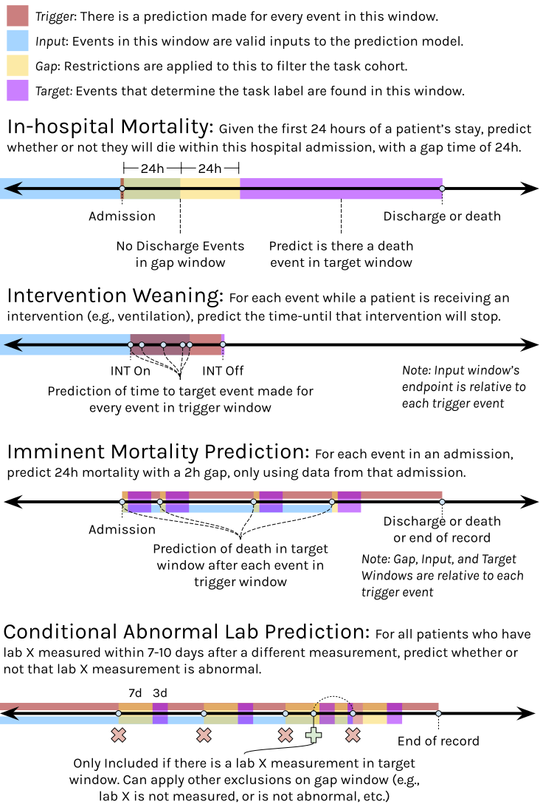

# ESGPT Task Querying - Coming Soon...


## Background

Event Stream GPT (ESGPT) is a library that streamlines the development of generative, pre-trained transformers (i.e., foundation models) over event stream datasets, such as Electronic Health Records (EHR). ESGPT is designed to extract, preprocess, and manage these datasets efficiently, providing a Huggingface-compatible modeling API and introducing critical capabilities for representing complex intra-event causal dependencies and measuring zero-shot performance. For more detailed information, please refer to the ESGPT GitHub repository: [ESGPT GitHub Repo](https://github.com/esgpt).

A feature of ESGPT is the ability to query EHR datasets for valid subjects, guided by various constraints and requirements defined in a YAML configuration file. This streamlines the process of extracting task-specific cohorts from large time-series datasets, offering a powerful and user-friendly solution to researchers and developers. The use of a human-readable YAML configuration file also eliminates the need for users to be proficient in complex dataframe querying, making the querying process accessible to a broader audience.

There are diverse applications in healthcare and beyond. For instance, researchers can effortlessly define subsets of EHR datasets for training of foundational models. Retrospective analyses can also become more accessible to clinicians as it enables the extraction of tailored cohorts for studying specific medical conditions or population demographics.

This README provides an overview of this feature, including a description of the YAML configuration file's fields (see `sample_config.yaml`), an outline of the algorithm, and instructions for use.

## Task Schema Definition

Provided below are several examples of clinically-meaningful tasks that ESGPT Task Querying could easily extract subject cohorts for:



## Dependencies

- polars
- bigtree
- ruamel.yaml

## Installation
1. Install EventStreamGPT (https://github.com/mmcdermott/EventStreamGPT):

Clone EventStreamGPT
```
git clone https://github.com/mmcdermott/EventStreamGPT.git
```
Install package with dependencies from the root directory of the cloned repo
```
pip install -e .
```

2. Install ESGPT Task Querying:

Clone ESGPT Task Querying
```
git clone https://github.com/justin13601/ESGPTTaskQuerying.git
```
Install package with dependencies from the root directory of the cloned repo
```
pip install . --force-reinstall
```

## Instructions for Use

1. **Prepare the YAML Configuration File**: Define your predicates and windows according to your research needs. Please see below for details regarding the configuration language.
2. **Load ESGPT Task Querying**: Set-up and import ESGPT Task Querying into your environment.
```
from esgpt_task_querying import main
```
3. **Run the Query**: Use ESGPT Task Querying with your YAML file to query a ESGPT dataset.
```
df_result = main.query_task(
            cfg_path='/path/to/config.yaml',
            data='/path/to/folder/of/ESGPT/dataset/'
        )
```
4. **Results**: The output will be a dataframe of subjects who satisfy the conditions defined in your YAML file. Timestamps for an edge of each window specified in the YAML, as well as predicate counts for each window, are also provided.

## YAML Configuration File

The YAML configuration file allows users to define specific predicates and windows to query the ESD. Below is a description of each field:

### Predicates

Predicates describe the event at a timestamp. Predicate columns begin with `is_` and are initialized as binary counts for each row of your ESD. Here is an example .csv file with predicate columns generated.

```
subject_id,timestamp,event_type,dx,lab_test,lab_value,is_death,is_admission,is_discharge,is_covid,is_death_or_discharge,is_any
1,12/1/1989 12:03,ADMISSION,,,,0,1,0,0,0,1
1,12/1/1989 13:14,LAB,,SpO2,99,0,0,0,0,0,1
1,12/1/1989 15:17,LAB,,SpO2,98,0,0,0,0,0,1
1,12/1/1989 16:17,LAB,,SpO2,99,0,0,0,0,0,1
1,12/1/1989 20:17,LAB,,SpO2,98,0,0,0,0,0,1
1,12/2/1989 3:00,LAB,,SpO2,99,0,0,0,0,0,1
1,12/2/1989 9:00,DIAGNOSIS,FLU,,,0,0,0,0,0,1
1,12/2/1989 15:00,DISCHARGE,,,,0,0,1,0,1,1
```

There are two types of predicates that can be defined in the configuration file. They can represent explicit ESD events and be defined by (`column`, `value`) pairs:

- `column`: Specifies the column in the dataset to apply the predicate. Must be a string matching an ESD column name.
- `value`: The value to match in the specified `column`.

OR, they can combine existing predicates using `ANY` or `ALL` keywords in the (`type`, `predicates`) pairs:

- `type`: Must be `ANY` or `ALL`.
- `predicates`: Must be list of existing predicate names defined using the above configuration.

### Windows

Windows can be of two types. It can be a temporally-bound window defined by a `duration` and one of `start`/`end`. It can also be an event-bound window defined by a `start` and an `end`.

- `start`: Must be a string matching a predicate name or containing a window name to express window relationship.
- `duration`: Must be a positive or negative time period expressed as a string (ie. 2 days, -365 days, 12 hours, 30 minutes, 60 seconds).
- `offset`: Not yet available.
- `end`: Must be a string matching a predicate name or containing a window name to express window relationship.
- `excludes`: Listed `predicate` fields matching a predicate name. Used to exclude a predicate in the window.
- `includes`: Listed `predicate` fields matching a predicate name. Used to include a predicate in the window, with `min` and `max` specifying the constraints for occurrences (`None` is set where `min`/`max` is left blank).
- `st_inclusive`, `end_inclusive`: Boolean flags to indicate if events at the start and end of the window timestamps are included in the defined window.
- `label`: Must be a string matching a predicate name.

Each window uses these fields to define specific time frames and criteria within the dataset.

A sample YAML configuration file is provided in `sample_config.yaml`.

## Recursive Algorithm Description

A tree structure is constructed based on the windows defined in the configuration file. This tree represents the hierarchical relationship between different time windows, where each node represents a window with its specific constraints. A set of base functions are required for the algorithm:

- `summarize_temporal_window()` creates a summary of predicate counts within a specified temporally-bound window.

- `summarize_event_bound_window()` creates a summary of predicate counts within a specified event-bound window.

- `summarize_window()` combines the functionalities of the above two functions.

- `check_constraints()` checks if the predicate counts in a window satisfy the inclusion and exclusion constraints of the window.

`query_subtree()` is recursively called to query each subtree in the tree structure in a depth-first manner. The function first summarizes the temporal- or event-bound window defined at each node by calling `summarize_window()`. Then, the returned summaries are filtered accordingly by `check_constraints()`. The resulting valid rows from each recursed node is then merged to form the final result.

## Acknowledgements

**Matthew McDermott**, PhD | *Harvard Medical School*

For any questions, enhancements, or issues, please file a GitHub issue. For inquiries regarding Event Stream GPT, please refer to the ESGPT repository. Contributions are welcome via pull requests.
