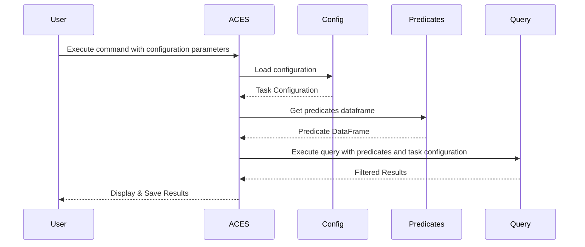

# ACES: Automatic Cohort Extraction System for Event Stream Datasets

[](https://www.python.org/downloads/release/python-3100/)
[](https://hydra.cc/)
[](https://codecov.io/gh/justin13601/ACES)
[](https://github.com/justin13601/ACES/actions/workflows/test.yml)
[](https://github.com/justin13601/ACES/actions/workflows/code-quality-master.yaml)
[](https://eventstreamaces.readthedocs.io/en/latest/?badge=latest)
[](https://github.com/justin13601/ACES/graphs/contributors)
[](https://github.com/justin13601/ACES/pulls)
[](https://github.com/justin13601/ACES#license)

## Background

Automatic Cohort Extraction System (ACES) is a library that streamlines the extraction of task-specific cohorts from time series datasets formatted as event streams, such as Electronic Health Records (EHR). ACES is designed to query these EHR datasets for valid subjects, guided by various constraints and requirements defined in a YAML task configuration file. This offers a powerful and user-friendly solution to researchers and developers. The use of a human-readable YAML configuration file also eliminates the need for users to be proficient in complex dataframe querying, making the extraction process accessible to a broader audience.

There are diverse applications in healthcare and beyond. For instance, researchers can effortlessly define subsets of EHR datasets for training of foundation models. Retrospective analyses can also become more accessible to clinicians as it enables the extraction of tailored cohorts for studying specific medical conditions or population demographics.

Currently, two data standards are supported: the [MEDS](https://github.com/Medical-Event-Data-Standard/meds) standard and the [EventStreamGPT (ESGPT)](https://github.com/mmcdermott/EventStreamGPT) standard. You must format your in one of these two formats by following instructions in their respective repositories. Alternatively, you may also format your data as a `.csv` in the same format as shown in `sample_data/sample_data.csv`. More information about this is available below.

This README provides an overview of this tool, including a brief description of the fields in the task configuration file (see configs in `sample_configs/`) and instructions for use. Please refer to the [documentation](https://eventstreamaces.readthedocs.io/en/latest/) for more detailed information.

## Dependencies

- polars == 0.20.\*
- bigtree == 0.18.\*
- ruamel.yaml == 0.18.\*
- loguru == 0.7.\*
- hydra-core == 1.3.\*
- pytimeparse == 1.1.\*
- networkx == 3.3.\*
- pyarrow == 16.1.\*

## Installation

1. If using the ESGPT data standard, install [EventStreamGPT (ESGPT)](https://github.com/mmcdermott/EventStreamGPT):

Clone EventStreamGPT:

```bash
git clone https://github.com/mmcdermott/EventStreamGPT.git
```

Install with dependencies from the root directory of the cloned repo:

```bash
pip install -e .
```

**Note**: To avoid potential dependency conflicts, please install ESGPT first before installing ACES. This ensures compatibility with the `polars` version required by ACES.

2. Install ACES:

```bash
pip install es-aces
```

## Instructions for Use



1. **Prepare a Task Configuration File**: Define your predicates and task windows according to your research needs. Please see below or the [documentation](https://eventstreamaces.readthedocs.io/en/latest/configuration.html) for details regarding the configuration language.
2. **Prepare Dataset into Supported Standards**: Process your dataset according to instructions for the [MEDS](https://github.com/Medical-Event-Data-Standard/meds) or [ESGPT](https://github.com/mmcdermott/EventStreamGPT) standard. You could also create a `.csv` in the same format as `sample_data/sample_data.csv` by defining predicate columns (more information below and in the [documentation](https://eventstreamaces.readthedocs.io/en/latest/notebooks/predicates.html)).
3. **Execute Query**: A query may be executed using either the command-line interface or by importing the package in Python:

### Command-Line Interface:

```bash
aces-cli data.path='/path/to/data/file/or/directory' data.standard='<esgpt/meds/direct>' cohort_dir='/directory/to/task/config/' cohort_name='<task_config_name>'
```

For help using `aces-cli`:

```bash
aces-cli --help
```

### Python Code:

```python
from aces import config, predicates, query
from omegaconf import DictConfig

# create task configuration object
cfg = config.TaskExtractorConfig.load(config_path="/path/to/task/config/task.yaml")

# get predicates dataframe
data_config = DictConfig(
    {
        "path": "/path/to/data/file/or/directory",
        "standard": "<esgpt/meds/direct>",
        "ts_format": "%m/%d/%Y %H:%M",
    }
)
predicates_df = predicates.get_predicates_df(cfg=cfg, data_config=data_config)

# execute query and get results
df_result = query.query(cfg=cfg, predicates_df=predicates_df)
```

**Results**: The output will be a dataframe of subjects who satisfy the conditions defined in your task configuration file. Timestamps for the start/end boundaries of each window specified in the task configuration, as well as predicate counts for each window, are also provided. Below are sample logs for the successful extraction of an in-hospital mortality cohort using the ESGPT standard:

```log
aces-cli data.path='MIMIC_ESD_new_schema_08-31-23-1/' data.standard='esgpt' cohort_dir='sample_configs/' cohort_name='inhospital-mortality'
2024-05-31 18:22:09.313 | INFO     | aces.__main__:main:27 - Loading config from sample_configs//inhospital-mortality.yaml
2024-05-31 18:22:09.319 | INFO     | aces.config:load:812 - Parsing predicates...
2024-05-31 18:22:09.319 | INFO     | aces.config:load:818 - Parsing trigger event...
2024-05-31 18:22:09.319 | INFO     | aces.config:load:821 - Parsing windows...
2024-05-31 18:22:09.330 | INFO     | aces.__main__:main:30 - Attempting to get predicates dataframe given:
path: MIMIC_ESD_new_schema_08-31-23-1/
standard: esgpt
ts_format: '%m/%d/%Y %H:%M'

Loading events from MIMIC_ESD_new_schema_08-31-23-1/events_df.parquet...
Loading dynamic_measurements from MIMIC_ESD_new_schema_08-31-23-1/dynamic_measurements_df.parquet...
2024-05-31 18:22:13.107 | INFO     | aces.predicates:generate_plain_predicates_from_esgpt:235 - Generating plain predicate columns...
2024-05-31 18:22:13.268 | INFO     | aces.predicates:generate_plain_predicates_from_esgpt:246 - Added predicate column 'admission'.
2024-05-31 18:22:13.432 | INFO     | aces.predicates:generate_plain_predicates_from_esgpt:246 - Added predicate column 'discharge'.
2024-05-31 18:22:13.600 | INFO     | aces.predicates:generate_plain_predicates_from_esgpt:246 - Added predicate column 'death'.
2024-05-31 18:22:18.654 | INFO     | aces.predicates:generate_plain_predicates_from_esgpt:267 - Cleaning up predicates DataFrame...
2024-05-31 18:22:18.655 | INFO     | aces.predicates:get_predicates_df:395 - Loaded plain predicates. Generating derived predicate columns...
2024-05-31 18:22:18.665 | INFO     | aces.predicates:get_predicates_df:398 - Added predicate column 'discharge_or_death'.
2024-05-31 18:22:18.666 | INFO     | aces.predicates:get_predicates_df:402 - Generating _ANY_EVENT predicate column...
2024-05-31 18:22:18.682 | INFO     | aces.predicates:get_predicates_df:404 - Added predicate column '_ANY_EVENT'.
2024-05-31 18:22:19.300 | INFO     | aces.query:query:29 - Checking if (subject_id, timestamp) columns are unique...
2024-05-31 18:22:19.675 | INFO     | aces.utils:log_tree:57 -
trigger
┗━━ input.end
    ┣━━ input.start
    ┗━━ gap.end
        ┗━━ target.end
2024-05-31 18:22:19.675 | INFO     | aces.query:query:40 - Beginning query...
2024-05-31 18:22:19.675 | INFO     | aces.query:query:41 - Identifying possible trigger nodes based on the specified trigger event...
2024-05-31 18:22:19.808 | INFO     | aces.constraints:check_constraints:93 - Excluding 14,623,763 rows as they failed to satisfy 1 <= admission <= None.
2024-05-31 18:22:19.905 | INFO     | aces.extract_subtree:extract_subtree:249 - Summarizing subtree rooted at 'input.end'...
2024-05-31 18:22:24.748 | INFO     | aces.extract_subtree:extract_subtree:249 - Summarizing subtree rooted at 'input.start'...
2024-05-31 18:22:35.102 | INFO     | aces.constraints:check_constraints:93 - Excluding 12,212 rows as they failed to satisfy 5 <= _ANY_EVENT <= None.
2024-05-31 18:22:35.116 | INFO     | aces.extract_subtree:extract_subtree:249 - Summarizing subtree rooted at 'gap.end'...
2024-05-31 18:22:38.992 | INFO     | aces.constraints:check_constraints:93 - Excluding 353 rows as they failed to satisfy None <= admission <= 0.
2024-05-31 18:22:38.993 | INFO     | aces.constraints:check_constraints:93 - Excluding 9,596 rows as they failed to satisfy None <= discharge <= 0.
2024-05-31 18:22:38.993 | INFO     | aces.constraints:check_constraints:93 - Excluding 88 rows as they failed to satisfy None <= death <= 0.
2024-05-31 18:22:38.995 | INFO     | aces.extract_subtree:extract_subtree:249 - Summarizing subtree rooted at 'target.end'...
2024-05-31 18:22:49.754 | INFO     | aces.query:query:57 - Done. 56,893 valid rows returned.
2024-05-31 18:22:49.864 | INFO     | aces.__main__:main:38 - Completed in 0:00:40.550664. Results saved to sample_configs//inhospital-mortality.parquet.
```

## Task Configuration File

The task configuration file allows users to define specific predicates and windows to query your dataset. Below is a sample generic configuration file in its most basic form:

```yaml
predicates:
  predicate_1:
    code: ???
  ...

trigger: ???

windows:
  window_1:
    start: ???
    end: ???
    start_inclusive: ???
    end_inclusive: ???
    has:
      predicate_1: (???, ???)

    label: ???
    index_timestamp: ???
  ...
```

Sample task configuration files for various common tasks are provided in `sample_configs/`.

### Predicates

Predicates describe the event at a timestamp and are used to create predicate columns that contain predicate counts for each row of your dataset. If the MEDS or ESGPT data standard is used, ACES automatically computes the predicates dataframe needed for the query from the `predicates` fields in your task configuration file. However, you may also choose to construct your own predicates dataframe should you not wish to use the MEDS or ESGPT data standard.

Example predicates dataframe `.csv`:

```
subject_id,timestamp,death,admission,discharge,covid,death_or_discharge,_ANY_EVENT
1,12/1/1989 12:03,0,1,0,0,0,1
1,12/1/1989 13:14,0,0,0,0,0,1
1,12/1/1989 15:17,0,0,0,0,0,1
1,12/1/1989 16:17,0,0,0,0,0,1
1,12/1/1989 20:17,0,0,0,0,0,1
1,12/2/1989 3:00,0,0,0,0,0,1
1,12/2/1989 9:00,0,0,0,0,0,1
1,12/2/1989 15:00,0,0,1,0,1,1
```

There are two types of predicates that can be defined in the configuration file, "plain" predicates, and "derived" predicates.

#### Plain Predicates

"Plain" predicates represent explicit values (either `str` or `int`) in your dataset at a particular timestamp and has 1 required `code` field (for string categorical variables) and 4 optional fields (for integer or float continuous variables). For instance, the following defines a predicate representing normal SpO2 levels (a range of 90-120 corresponding to rows where the `lab` column is `O2 saturation pulseoxymetry (%)`):

```yaml
normal_spo2:
  code: lab//O2 saturation pulseoxymetry (%)     # required <str>//<str>
  value_min: 90                                  # optional <float/int>
  value_max: 120                                 # optional <float/int>
  value_min_inclusive: true                      # optional <bool>
  value_max_inclusive: true                      # optional <bool>
```

Fields for a "plain" predicate:

- `code` (required): Must be a string with `//` sequence separating the column name and column value.
- `value_min` (optional): Must be float or integer specifying the minimum value of the predicate, if the variable is presented as numerical values.
- `value_max` (optional): Must be float or integer specifying the maximum value of the predicate, if the variable is presented as numerical values.
- `value_min_inclusive` (optional): Must be a boolean specifying whether `value_min` is inclusive or not.
- `value_max_inclusive` (optional): Must be a boolean specifying whether `value_max` is inclusive or not.

#### Derived Predicates

"Derived" predicates combine existing "plain" predicates using `and` or `or` keywords and have exactly 1 required `expr` field: For instance, the following defines a predicate representing either death or discharge (by combining "plain" predicates of `death` and `discharge`):

```yaml
# plain predicates
discharge:
  code: event_type//DISCHARGE
death:
  code: event_type//DEATH

# derived predicates
discharge_or_death:
  expr: or(discharge, death)
```

Field for a "derived" predicate:

- `expr`: Must be a string with the 'and()' or 'or()' key sequences, with "plain" predicates as its constituents.

A special predicate `_ANY_EVENT` is always defined, which simply represents any event, as the name suggests. This predicate can be used like any other predicate manually defined (ie., setting a constraint on its occurrence or using it as a trigger, more information below).

### Trigger Event

The trigger event is a simple field with a value of a predicate name. For each trigger event, a predication by a model can be made. For instance, in the following example, the trigger event is an admission. Therefore, in your task, a prediction by a model can be made for each valid admission (after extraction according to other task specifications).

```yaml
predicates:
  admission:
    code: event_type//ADMISSION

trigger: admission                    # trigger event <predicate>
```

### Windows

Windows can be of two types, a temporally-bounded window or an event-bounded window. Below is a sample temporally-bounded window configuration:

```
trigger: admission

input:
  start: NULL
  end: trigger + 24h
  start_inclusive: True
  end_inclusive: True
  has:
    _ANY_EVENT: (5, None)
```

In this example, the window `input` begins at `NULL` (ie., the first event or the start of the time series record), and ends at 24 hours after the `trigger` event, which is specified to be a hospital admission. The window is inclusive on both ends (ie., both the first event and the event at 24 hours after the admission, if any, is included in this window). Finally, a constraint of 5 events of any kind is placed so any valid window would include sufficient data.

Two fields (`start` and `end`) are required to define the size of a window. Both fields must be a string referencing a predicate name, or a string referencing the `start` or `end` field of another window name. In addition, it may express a temporal relationship by including a positive or negative time period expressed as a string (ie., `+ 2 days`, `- 365 days`, `+ 12h`, `- 30 minutes`, `+ 60s`). It may also express an event relationship by including a sequence with a directional arrow and a predicate name (ie., `-> predicate_1` or `<- predicate_1`). Finally, it may also contain `NULL`, indicating the first/last event for the `start`/`end` field, respectively.

`start_inclusive` and `end_inclusive` are required booleans specifying whether the events, if any, at the `start` and `end` points of the window are included in the window.

The `has` field specifies constraints relating to predicates within the window. For each predicate defined previously, a constraint for occurrences can be set using a string in the format of `(<min>, <max>)`. Unbounded conditions can be specified by using `None` or leaving it empty (ie., `(5, None)`, `(8,)`, `(None, 32)`, `(,10)`).

`label` is an optional field and can only exist in ONE window in the task configuration file if defined. It must be a string matching a defined predicate name, and is used to extract the label for the task.

`index_timestamp` is an optional field and can only exist in ONE window in the task configuration file if defined. It must be either `start` or `end`, and is used to create an index column used to easily manipulate the results output. Usually, one would set it to be the time at which the prediction would be made (ie., set to `start` in your target window).

## FAQs

### Static Data

Support for static data depends on your data standard and those variables are expressed. For instance, in MEDS, it is feasible to express static data as a predicate, and thus criteria can be set normally. However, this is not yet incorporated for ESGPT. If a predicates dataframe is directly used, you may create a predicate column that specifies your static variable.

## Future Roadmap

### Sequential Decoding Tasks

We hope to support tasks whose labels cannot be reliably summarized as a single numerical value (ie., a task where we want to predict a sequence of outputs, such as future treatment sequences).

### Case-Control Matching Extraction

Currently, case-control matching (ie., gender-matching, age-matching, etc.) is not directly supported. In order to extract matched cohorts, you may extract the cases and controls cohorts separately, then perform post-hoc matching.

### Tasks with Multiple Endpoints

It is currently tricky to express tasks that have multiple endpoints. For instance, to extract a cohort for 30-day mortality, you would require patients that died within 30 days of a given timestamp (ie., contains `death` predicate in a window), as well as patients that did not die within the same 30 days (ie., patients with data 30-days past the given timestamp). An overlapping 30-day window could be used to express this, which would create two branches in the task tree. However, it is not yet possible to express an `OR` condition across branches (ie., the `AND` relationship is evaluated across different branches). As such, to extract this cohort, you would also have to make use of two configuration files, one to extract a cohort of those that meet criteria for the first branch (ie., death within 30 days), and one for the other branch (ie., data past 30 days).

### Timestamp Binning

Unfortunately, it is currently not possible to index at a specific wall time (ie., have time of day offsets). As such, cohorts that require a prediction at 11:59 PM on the day of the patient's admission, for example, cannot be directly extracted.

### Nested Configurations

We aim to support nested configuration files for cohort querying, whereby the results of a particular extraction can be expressed as a predicate to inform the extraction of another cohort. This would allows users to extract cohorts for very complex and specific tasks.

### Complex Predicates

We hope to support more complex predicates that are not expressed as codes in datasets (ie., those that require aggregations of medians/running averages over time to measure disease progression), as well as derived predicates with `not()` or nested boolean logic. In both cases, predicates can currently be specified manually by creating the predicates dataframe directly.

## Acknowledgements

**Matthew McDermott**, PhD | *Harvard Medical School*

**Alistair Johnson**, DPhil | *Independent*

**Jack Gallifant**, MD | *Massachusetts Institute of Technology*

**Tom Pollard**, PhD | *Massachusetts Institute of Technology*

**Curtis Langlotz**, MD, PhD | *Stanford University*

**David Eyre**, BM BCh, DPhil | *University of Oxford*

For any questions, enhancements, or issues, please file a GitHub issue. For inquiries regarding MEDS or ESGPT, please refer to their respective repositories. Contributions are welcome via pull requests.
