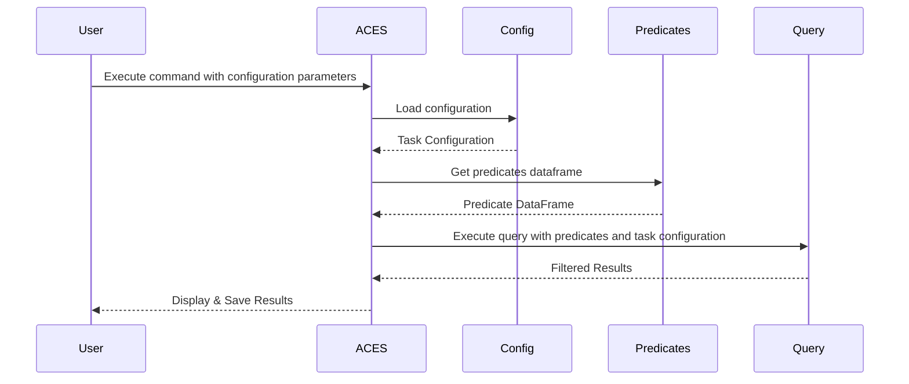

# ACES in Python

```mermaid
sequenceDiagram
    participant User
    participant ACES
    participant Config
    participant Predicates
    participant Query

    User->>ACES: Execute command with configuration parameters
    ACES->>Config: Load configuration
    Config-->>ACES: Task Configuration
    ACES->>Predicates: Get predicates dataframe
    Predicates-->>ACES: Predicate DataFrame
    ACES->>Query: Execute query with predicates and task configuration
    Query-->>ACES: Filtered Results
    ACES-->>User: Display & Save Results
```

Please see the tutorial in the [ACES Documentation](https://eventstreamaces.readthedocs.io/en/latest/notebooks/tutorial.html) for information on how to use ACES in Python.
